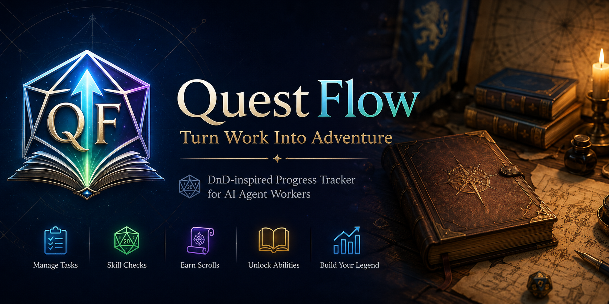
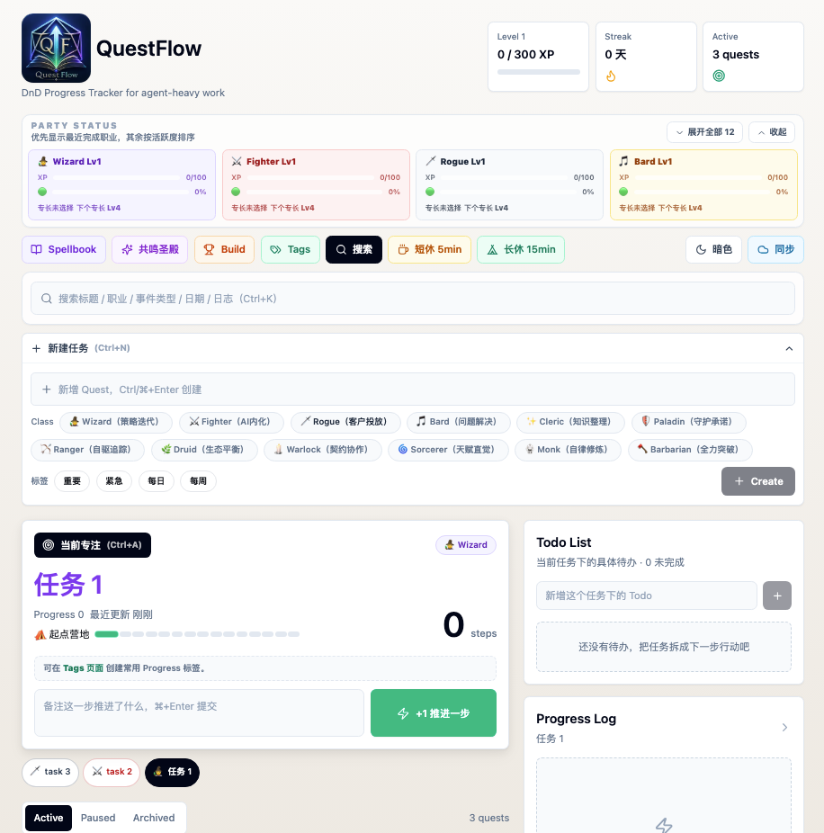

# QuestFlow v2.0

QuestFlow 是一个专为 AI 时代知识工作者设计的轻量级任务推进器，融合了 DnD 职业成长体系和 RPG 任务日志体验。

它不强调把任务勾选为完成，而是鼓励用户每天把长期任务继续往前推进一步。

在 AI Agent 逐渐成为工作伙伴的今天，越来越多的工作不再是「创建任务 → 完成任务」的线性过程，而是多个长期任务并行推进、频繁切换上下文、持续迭代优化的过程。

对于工程师、产品经理、研究员和 Agent 用户来说，真正重要的往往不是「完成了多少任务」，而是：

> 今天是否让重要的事情向前推进了一步。

QuestFlow 希望记录和奖励这种持续推进的过程——并且让它变得有趣。

## 核心理念

传统 Todo 软件奖励完成任务。QuestFlow 奖励推进任务。

核心循环：

> 推进任务 → 职业经验 → 技能检定 → 获得卷轴 → 学习/升环技能线 → 职业升级 → 选择永久专长 → 自动形成 Build → 短休/长休恢复

适合这些工作流：

- Agent 实验
- 模型评测
- 技术调研
- PRD 编写
- Bug 修复
- 任何持续数天或数周的知识工作



## 更新日志

参见 [CHANGELOG.md](./CHANGELOG.md)。

## 功能

### 任务管理

- 快速创建 Quest：输入标题后 `Ctrl/⌘+Enter` 创建，Enter 换行；`Ctrl/⌘+N` 可直接打开新建任务
- 全局搜索：支持按标题、职业、任务标签、事件类型、日期、Todo、共鸣、卷轴和日志内容搜索；`Ctrl/⌘+K` 快速聚焦搜索框
- 快速专注：`Ctrl/⌘+A` 可专注当前搜索结果中的第一项 Active 任务
- 任务列表：展示 Active、Paused、Archived 状态
- Focus 模式：同一时间只有一个当前专注任务
- 当前专注下方提供快速任务选取栏，按创建时间固定排序，方便在长期 Active 任务中查找
- Progress 推进：一键 `+1`，记录每一步推进；仅点击推进后 Active 任务才会移动到列表底部，单纯追踪/切换专注不改变位置
- Progress Log：保存推进时间、备注、常用 Progress 标签、XP、职业经验、技能检定结果
- 职业标签：支持 12 种职业（按钮选择）
- 任务标签：支持 重要（🔵）/ 紧急（🔴）/ 每日（🟢）/ 每周（🟠），重要与紧急提供 XP 加成，每日/每周用于周期任务
- 周期任务：当前专注为每日/每周任务时可点击“完成今日/完成本周”归档；跨天/跨周后会自动回到 Active
- 常用 Progress 标签：在 `/tags` 页面配置可复用标签与预设颜色，推进时一键选择，避免重复输入固定备注

### 职业体系

每个职业绑定一种真实工作类型：

| 职业 | Emoji | 工作类型 | 卷轴 |
|------|-------|----------|------|
| Wizard | 🧙 | 策略迭代 | 奥术卷轴 |
| Fighter | ⚔️ | AI内化 | 战技卷轴 |
| Rogue | 🗡️ | 客户投放 | 诡术卷轴 |
| Bard | 🎵 | 问题解决 | 灵感卷轴 |
| Cleric | ✨ | 知识整理 | 神恩卷轴 |
| Paladin | 🛡️ | 守护承诺 | 誓言卷轴 |
| Ranger | 🏹 | 自驱追踪 | 狩猎卷轴 |
| Druid | 🌿 | 生态平衡 | 自然卷轴 |
| Warlock | 🕯️ | 契约协作 | 契约卷轴 |
| Sorcerer | 🌀 | 天赋直觉 | 血脉卷轴 |
| Monk | 🥋 | 自律修炼 | 气脉卷轴 |
| Barbarian | 🪓 | 全力突破 | 狂怒卷轴 |

- 每个任务创建时选择职业
- 推进任务时获得对应职业 XP
- 每个职业拥有独立等级，职业等级 = XP / 100 + 1

### 专长与 Build

职业达到 Lv4 / Lv8 / Lv12 / Lv16... 时会获得专长点，并从随机 3 个专长中永久选择 1 个。

- 专长流派：学习流、专注流、幸运流、共鸣流、收集流、休息流
- 专长品质：普通、稀有、史诗、传奇
- 专长会影响 Progress XP、职业 XP、技能检定、卷轴、共鸣奖励和休息收益
- 专长选择采用二次确认：先点选专长，再点击确认；也可以稍后在 `/build` 页面选择，确认后仍可通过一次性撤销提示恢复
- `/build` 页面会自动根据专长、职业 XP、共鸣和技能图鉴识别 Build，并展示待选择专长
- 可识别 Build 包括：命运编织者、博学者、执行大师、共鸣大师、收藏宗师、荒野旅者、Spellblade、奥术诡术师、Agent Architect

### 技能检定

每次推进有 50% 概率触发技能检定：

- 投 d20 + 等级修正 vs DC 10~15
- 职业 1 级使用公平 d20
- 职业 2 级开始获得等级优势：每级约 +2% 概率触发双骰取高，真实投骰点数更容易变大
- **大成功**（自然 20）：额外 +10 XP + 获得 2 枚职业卷轴
- **成功**：额外 +5 XP + 获得 1 枚职业卷轴
- **失败**：无额外奖励
- 各职业检定技能不同（如 Wizard：奥术/调查/历史/自然）
- Progress Log 会记录检定 DC、投骰点数、修正值和最终结果

### 任务标签与 Progress 标签

创建任务时可选择任务标签，历史任务卡片也可直接修改标签：

| 标签 | 颜色 | XP 加成 | 用途 |
|------|------|---------|------|
| 重要（Important） | 🔵 蓝色 | +3 XP | 标记高价值任务 |
| 紧急（Urgent） | 🔴 红色 | +2 XP | 标记时效任务 |
| 重要 + 紧急 | 🟣 紫色 | +5 XP | 最高优先级奖励 |
| 每日（Daily） | 🟢 绿色 | 无 | 完成今日后归档，次日未完成时自动回到 Active |
| 每周（Weekly） | 🟠 橙色 | 无 | 完成本周后归档，下周未完成时自动回到 Active |

目的：重要/紧急引导优先推进真正重要的任务；每日/每周用于维护周期性任务，不改变 XP 奖励。

Progress 标签不影响 XP，用于记录推进语义。可在 `/tags` 创建例如“群追踪”“复盘”“客户跟进”等可复用标签，选择预设颜色后会显示在首页推进区和 Progress Log 中。

### 疲劳值系统

每个职业拥有独立疲劳值（0~100），每次推进任务增加 +5 疲劳。

| 疲劳范围 | 阶段 | Emoji | 奖励倍率 |
|----------|------|-------|---------|
| 0~30 | 精力充沛 | 🟢 | 100% |
| 31~60 | 轻度疲劳 | 🟡 | 90% |
| 61~80 | 疲劳 | 🟠 | 75% |
| 81~100 | 极度疲劳 | 🔴 | 50% |

疲劳影响 XP 和职业经验获取，鼓励用户切换任务和职业。

### 休息系统

| 休息类型 | 时长 | 效果 |
|---------|------|------|
| ☕ 短休 | 5 分钟 | 所有职业恢复 30% 疲劳 |
| 🏕 长休 | 15 分钟 | 所有职业疲劳归零 + 触发今日冒险总结 |

- 休息期间有倒计时显示，可随时取消
- 短休不限次数

### 长休总结

长休结束后展示「今日冒险总结」：

- 每个职业的推进次数、XP 增长、卷轴获取、技能升级事件
- 总经验、总卷轴、连续天数
- 类似 DnD 营地休息体验

### 职业共鸣

连续推进两个不同职业的任务时触发 **✨ 职业共鸣**。12 个职业共有 66 个独立双职业组合，A+B 与 B+A 视为同一个共鸣。

- 每个组合有独立名称、徽章、描述和奖励，例如 `Wizard + Fighter = 🔥 魔剑士`
- 奖励池包括：+3 XP、+1 卷轴、-10 Fatigue、下次优势检定、幸运检定、双卷轴、长休额外卷轴
- 首次发现共鸣会弹出「新共鸣发现」动画，并自动收录到共鸣圣殿
- 普通触发使用 1 秒轻量动画，不打断继续操作
- 连续切换不同职业会形成「⚡ 共鸣链」，达到 x5 额外奖励卷轴 ×1

### 共鸣圣殿

点击「共鸣圣殿」进入 `/resonance` 页面，查看 12×12 职业关系矩阵：

- 未解锁组合显示 `?`，提示连续推进两个职业即可发现
- 已解锁组合显示独立徽章、共鸣名称和等级
- 同职业对角线为禁用状态，不触发共鸣
- 点击已解锁格子查看详情：职业组合、解锁时间、触发次数、奖励效果、描述

### 共鸣等级

每个共鸣会根据触发次数成长：

| 等级 | 触发次数 |
|------|----------|
| Lv1 | 1 次 |
| Lv2 | 5 次 |
| Lv3 | 20 次 |
| Lv4 | 50 次 |
| Lv5 | 100 次 |

达到新等级时会显示「✨ 共鸣升级」，让老组合也有长期成长价值。

### 技能线系统

每个职业有 **5 条技能线**，每条线有 **9 个环阶**（一环~九环），共 **12 × 5 × 9 = 540 个技能**。

**技能线一览**：

| 职业 | 线1 | 线2 | 线3 | 线4 | 线5 |
|------|-----|-----|-----|-----|-----|
| 🧙 Wizard | 魔法飞弹系 | 护盾系 | 火焰系 | 传送系 | 控制系 |
| ⚔️ Fighter | 动作激增系 | 精准打击系 | 顺劈系 | 冲锋系 | 防御系 |
| 🗡️ Rogue | 偷袭系 | 灵巧动作系 | 闪避系 | 潜行系 | 暗杀系 |
| 🎵 Bard | 吟游激励系 | 魅惑系 | 治愈系 | 幻术系 | 传说系 |
| ✨ Cleric | 治疗系 | 祝福系 | 神圣攻击系 | 防护系 | 复活系 |
| 🛡️ Paladin | 神圣打击系 | 誓言系 | 光环系 | 治疗系 | 召唤坐骑系 |
| 🏹 Ranger | 猎人印记系 | 箭术系 | 陷阱系 | 野兽系 | 生存系 |
| 🌿 Druid | 野性变身系 | 植物系 | 月亮系 | 元素系 | 治愈系 |
| 🕯️ Warlock | 魔能爆系 | 契约系 | 诅咒系 | 黑暗系 | 召唤系 |
| 🌀 Sorcerer | 火焰血脉系 | 风暴血脉系 | 龙脉系 | 超魔系 | 混沌系 |
| 🥋 Monk | 气功系 | 连击系 | 闪避系 | 身法系 | 心灵系 |
| 🪓 Barbarian | 狂怒系 | 图腾系 | 投掷系 | 坚韧系 | 震慑系 |

**升环示例（Wizard 魔法飞弹系）**：

| 一环 | 二环 | 三环 | 四环 | 五环 | 六环 | 七环 | 八环 | 九环 |
|------|------|------|------|------|------|------|------|------|
| 魔法飞弹 | 强效魔法飞弹 | 奥术飞弹 | 秘法飞弹 | 奥术洪流 | 奥术风暴 | 奥术毁灭 | 奥术灾变 | 许愿术 |

**学习规则**：
- 使用卷轴随机习得一条未拥有的技能线（从一环起步）
- 已习得全部线后，卷轴会给随机线增加副本

**升环规则**：
- 环阶由副本数决定：**tier n 需要 2^(n-1) 份副本**
- 1 份 → 一环，2 份 → 二环，4 份 → 三环，8 份 → 四环，...，256 份 → 九环
- 达到副本阈值时自动升环，技能名称随之变化
- 最高九环

### 法术书

点击 Spellbook 按钮打开法术书界面：
- 查看所有职业的等级、XP、技能线列表
- 已习得线显示当前环阶技能名称、环阶标签、9 格进度条、副本进度
- 未习得线显示 ??? 和线系名称
- 有卷轴时点击使用，触发卷轴开启动画

### 卷轴开启动画

使用卷轴时触发 ScrollReveal 动画：
- 📜 卷轴图标旋转弹出
- 卷轴名称 + 职业标识
- 技能名称大字揭示（缩放弹出）
- 环阶徽章展示
- 三种结果：习得新技能（绿色标签）/ 升环（环阶过渡箭头 + 上升光粒子）/ 增加副本
- 16 颗星形粒子向外扩散

### 游戏化成长

- **总 XP / Level**：每次推进获得 5+ XP，里程碑额外 +50 XP
- **职业 XP**：每次推进获得对应职业 5+ XP（检定成功额外加成）
- **Streak**：当天至少推进一次即计入连续推进天数
- **Momentum**：同一任务连续推进时展示连击反馈（3 次以上额外奖励）
- **Milestone**：达到 5/10/25/50 次推进时触发庆祝动画和额外奖励

### 任务地图

每个任务根据 progressCount 显示地图区域，背景会随区域变化：

| Progress | 区域 | Emoji |
|----------|------|-------|
| 0-4 | 起点营地 | ⛺ |
| 5-9 | 冒险小径 | 🥾 |
| 10-19 | 灵感森林 | 🌲 |
| 20-34 | 古代遗迹 | 🏛️ |
| 35-49 | 深度峡谷 | 🏔️ |
| 50-69 | 迷雾沼泽 | 🌫️ |
| 70-89 | 架构高塔 | 🗼 |
| 90-119 | 秘法图书馆 | 📚 |
| 120-149 | 星火熔炉 | 🔥 |
| 150-199 | 晨星城塞 | 🏰 |
| 200-249 | 回声深渊 | 🕳️ |
| 250-349 | 星界航道 | 🌌 |
| 350-499 | 星辰实验室 | 🧪 |
| 500-749 | 命运王座 | 👑 |
| 750+ | 传奇之门 | 🌠 |

进入新区域时触发提示，背景渐变色平滑过渡。当前专注区展示完整地图进度条，底部任务卡使用紧凑区域胶囊，避免任务后期地图进度过长溢出。

### 数据持久化

- **localStorage**：数据自动保存在浏览器本地
- **导出**：一键导出为 `questflow-backup.json`
- **导入**：从备份文件恢复数据，写入前会将当前 `questflow-v1` 快照保存到 `questflow-v1.backup`，并提供一次性撤销覆盖
- **WebDAV 同步**：通过独立同步页面配置 WebDAV，支持联通测试、云端导入、云端导出、下载云端 JSON 和一键同步
- **冲突处理**：如果本机和云端都晚于上次同步时间，会提示选择“使用本机存档 / 使用云端存档”；否则按最后修改者胜出
- **本机密钥文件**：WebDAV 地址、账户、密码保存在 `.questflow-webdav.local.json`；Electron 桌面端写入 `userData/questflow-webdav.local.json`
- **持久化保护**：localStorage 接近 4.5MB 时输出告警，导入/迁移使用严格 type guard 过滤异常结构
- 数据迁移：v1 → v3 → v4 → v5 → v6 → v7 → v8 → v9 → v10 → v11 → v12 → v13 → v14 → v15 自动迁移

### 动画反馈

- +1 推进：多层粒子爆炸（圆形/星形/菱形/圆环）+ 发光光晕 + XP 飘字
- 里程碑：烟花粒子 + 奖杯摇晃动画 + confetti 彩纸
- 技能检定：Dice Toast 显示投骰结果、成功/失败、XP 加成、卷轴获得
- 职业共鸣：普通触发 1 秒右侧轻量动画，首次发现触发新共鸣发现弹窗；可点击弹窗周围遮罩关闭
- 共鸣升级/连锁：显示 Lv 提升和 ⚡ 共鸣链倍率反馈
- 卷轴开启：ScrollReveal 动画，技能名称揭示 + 升环过渡 + 粒子效果
- 专注切换：Focus Changed 浮层

## 技术栈

- Next.js 15
- TypeScript
- Tailwind CSS
- Framer Motion
- Zustand（persist 中间件，版本迁移 v1→v15）
- Next.js Route Handlers（WebDAV API 代理）
- react-confetti
- localStorage

## 本地开发

安装依赖：

```bash
npm install
```

启动开发服务器：

```bash
npm run dev
```

打开：

```text
http://localhost:3000
```

生产构建：

```bash
npm run build
```

桌面构建：

```bash
npm run desktop:build        # macOS DMG
npm run desktop:build:win    # Windows NSIS/ZIP
npm run desktop:build:linux  # Linux AppImage
npm run desktop:build:all    # 先构建 Next，再顺序打包 macOS/Windows/Linux
```

桌面端包含单实例锁、Next standalone server 启动健康检查、友好错误页和 `userData/logs/questflow-crash.log` 启动/崩溃日志。

## 不包含

- 登录 / 账号系统
- 多人协作
- 真实付费 / 内购
- 排行榜 / 社交分享
- 服务端 / 数据库
- 原生系统通知
- 移动端 App（Web 端已补充触屏点击区、暗色主题和基础可访问性优化）

## License

MIT
